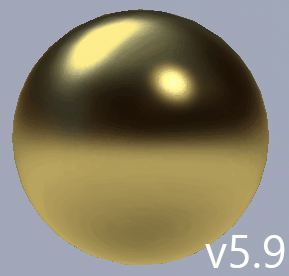
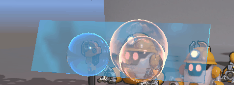
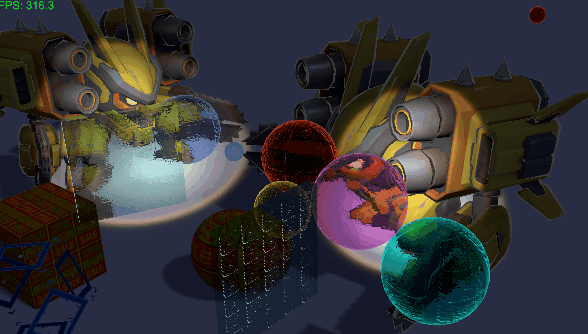

# VicTools (YD) - Unity 编辑器工具集

## 概述

VicTools(YD) 是一个功能强大的 Unity 编辑器工具集，提供高效的场景管理、材质查找、资源批量处理等功能，能显著提升美术及程序员在 Unity 引擎中的开发效率。该工具集包含自定义着色器 PBR_Mobile 及相关辅助脚本工具。

**类别**: Editor  
**文档链接**: [飞书文档](https://my.feishu.cn/wiki/GVDYwV0TFiEPl2kTJzWcwcI6n6d)

## <更新日志>

### 版本 2.7.10

- PBR_Mobile5.9 优化高光算法，高光随模型边缘形状挤压还原真实高光效果；增加金属反射对比及对反射的颜色控制。

  →
  
- Glass_carWindow添加Ramp渐变贴图，可用于模拟肥皂泡效果

  


### 版本 2.7.9

- PBR_Mobile5.8 优化高光基础能量：提高非金属材质的基础高光强度

- EmissionFlicker1.0 PBR_Mobile自发光闪烁脚本

- 添加"Custom\Texture"天空盒shader


### 版本 2.7.8

- 【性能分析1.7】 对象统计模块添加静态对象统计快速选择

- PBR_Mobile5.8 优化高光亮度，移除specularColor削减；烘焙高光受实时阴影影响（该版本高光更符合真实能量更高明亮）
  - 添加【存档】【读档】【重置参数】按钮还原所有参数默认值（读取Default存档）

    

- 工具主窗口左上角添加【Menu】辅助功能菜单，包含（`校正(PBR_Mobile)烘焙高光方向`、`校正PBR_Mobile5.8高光数值`）

  

- 添加适合车窗玻璃材质`Custom/Glass_carWindow`

  


### 版本 2.7.7

- 【场景工具2.15】 添加一键切换lighting材质可接收实时灯光(用于场景烘焙打灯时查看实时灯光效果)快速切换功能；支持PBR_Mobile_Trans材质烘焙高光校正

  
- PBR_Mobile5.6 修复烘焙后反射被烘焙光照覆盖的问题

  
- PBR_Mobile5.7 烘焙投影支持，使用Unity标准的Subtractive模式方法


### 版本 2.7.6

- 【性能分析1.6】
  - 优化未使用资源扫描和删除逻辑，修复 Prefab 嵌套依赖检测问题
  - 增强 Prefab 依赖关系检测，通过 GUID 引用识别嵌套 Prefab
  - 单个资源删除和批量删除都会检查依赖关系，防止误删
  - 列表中被引用的资源显示 "[被引用]" 标记，删除按钮置灰
  - 删除资源前进行双重验证：AssetDatabase 依赖检查 + GUID 文本引用检查
  - 对 Prefab、场景、材质等文件进行深度 GUID 引用扫描
  - 优化依赖检查性能，使用批量处理和进度显示
  
- PBR_Mobile5.3 优化自身阴影平滑度，减少阶梯状硬边
- PBR_Mobile5.4 性能优化 - 预计算PBR属性，消除重复计算，优化光源循环
- PBR_Mobile5.5 完善自身阴影与半兰伯特阴影；Lambert光照作为遮罩来平滑阴影锯齿

  


### 版本 2.7.5

- PBR_Mobile5.2 优化材质UI操作界面，隐藏未激活的参数缩减界面
- 【性能分析1.5】 优化未使用资源扫码准确度，精确查找BuildSetting中添加场景的资源使用，添加（扫描所有场景）选项
- 【场景工具2.13】 优化挑选二级选项逻辑，更准确的挑选操作
- 【Compute Buffer Tool v3.4】 管理器添加SpotTexture批量设置所有PBR_Mobile材质参数，优化在剔除、添加材质时更新材质参数


### 版本 2.7.4

- 【场景工具2.12】优化资源箱丢失对象保留正确名称，启动工具自动刷新
- 【ComputeBufferTool3.3】添加（剔除材质 ↑）按钮，可以剔除模型或Project中的材质球，强化（添加材质↓）按钮也可添加场景对象材质


### 版本 2.7.3

- 【场景工具2.11】完善[挑选]按钮功能优化判断逻辑
- 【ComputeBufferTool3.2】优化用户界面，添加（添加材质↓）按钮用于向管理器添加Project中选择的材质球


### 版本 2.7.2

- 优化挑选选项逻辑；添加（Reset）按钮用于关闭所有一级选项


### 版本 2.7.1

- 【场景工具2.9】添加[挑选]按钮，可以根据选项快速挑选相应对象，添加二级选择选项

- 【ComputeBufferTool3.1】优化材质列表，添加（选择材质）按钮用于选择收集的材质球


### 版本 2.6.1

- 【资源工具1.4】添加模型批量检查GenerateLightmapUVs 

- 【场景工具2.8】添加[Mesh]按钮，根据场景非预设模型快速选择

- PBR_Mobile5.1 添加聚光灯纹理彩色光环

  


### 版本 2.6.0

- 【场景工具2.7-资源箱】全局存档改为本地Library\VicTools；创建PathHelper类路径管理


### 版本 2.5.0

- Package打包版本，添加Outline描边Shader，主材质PBR_Mobile沿用老guid避免替换旧文件时材质丢失


### 版本 1.5.0

- 添加聚光灯支持
- 优化编辑器模式实时更新
- 改进资源箱文件管理
- 增强性能分析功能


### 版本 1.4.0

- 添加 Compute Buffer 多点光源支持
- 改进材质批量控制系统
- 优化着色器性能


### 版本 1.3.0

- 添加场景性能分析器
- 改进搜索历史管理
- 优化用户界面


## 主要功能模块

### 1. 场景工具 (ScenesTools)
**核心功能**：
- **速选工具**：快速选择场景中名称相似的对象
- **资源箱系统**：拖拽式资源管理，支持保存/加载资源箱文件
- **材质管理**：选择相同材质的对象，批量赋予材质
- **层级操作**：设置层级、跳出层级、选择层级
- **搜索历史**：智能搜索历史记录管理

**特色功能**：
- 支持拖拽 Project 或 Hierarchy 中的对象到资源箱
- 资源箱文件管理，可保存为 JSON 文件
- 支持 Ctrl/Shift 键多选操作
- 自动保存资源箱数据，防止数据丢失

### 2. PBR_Mobile 着色器系统
**版本演进**：
- PBR_Mobile 1.0-5.0：逐步添加金属度、粗糙度、AO、反射、点光源、聚光灯等高级功能

**核心特性**：
- **PBR 工作流**：金属度/粗糙度工作流，支持法线贴图
- **Compute Buffer 支持**：多点光源和聚光灯支持
- **性能优化**：移动端优化，支持顶点阴影
- **烘焙支持**：支持光照贴图烘焙
- **反射系统**：球形反射贴图，菲涅尔效果
- **自发光**：HDR 自发光，饱和度控制

**Shader 关键词**：
- `_USEPOINTLIGHT`：启用点光源
- `_USESPOTLIGHT`：启用聚光灯
- `_USEREFLECTION`：启用反射
- `_USEEMISSIONMAP`：启用自发光贴图
- `_NORMALMAP`：启用法线贴图
- `_USEMSAMAP`：启用金属度/粗糙度/AO 贴图

### 3. Compute Buffer 光照管理器
**核心功能**：
- **点光源管理**：收集场景点光源，通过 Compute Buffer 传输到 GPU
- **聚光灯管理**：支持聚光灯效果，包括光斑纹理
- **性能优化**：距离剔除、视锥体剔除、自适应更新
- **材质批量控制**：批量管理使用 PBR_Mobile 的材质
- **动态效果**：渐变、闪烁、回弹动画效果

**编辑器模式支持**：
- 非运行模式下实时预览点光效果
- 编辑器更新循环，模拟游戏循环
- 实时响应 Inspector 参数变化

### 4. 性能分析器 (ScenePerformanceAnalyzer)
- 场景性能分析
- 渲染统计
- 内存使用情况
- 优化建议

### 5. 着色器材质查找器 (ShaderMaterialFinder)
- 按着色器查找材质
- 批量材质操作
- 材质统计信息

### 6. 项目工具 (ProjectTools)
- 批量资源处理
- 文件管理工具
- 自动化工作流

## 使用方式

### 打开主窗口
1. 在 Unity 编辑器菜单栏选择：`Tools/VicTools(YD)/[ ScenesTools ]`
2. 或使用快捷键（如果配置）

### 主要工作流程
1. **场景管理**：
   - 使用搜索框查找场景对象
   - 拖拽对象到资源箱进行临时存储
   - 使用资源箱文件保存常用对象集合

2. **材质操作**：
   - 选择对象后点击"选择相同材质对象"
   - 从资源箱中选择材质并赋予选中对象
   - 使用材质选择器批量操作

3. **光照设置**：
   - 将场景中的点光源和聚光灯添加到 ComputeBufferLightManager
   - 调整光照参数（强度、范围、衰减）
   - 启用/禁用点光源或聚光灯效果

4. **性能分析**：
   - 打开性能分析器窗口
   - 分析场景性能瓶颈
   - 获取优化建议

## 技术特点

### 1. 架构设计
- **模块化设计**：每个工具都是独立的子窗口
- **可扩展性**：易于添加新工具模块
- **单例模式**：ComputeBufferLightManager 使用单例模式确保全局访问

### 2. 性能优化
- **Compute Buffer**：使用 GraphicsBuffer 高效传输光源数据
- **剔除系统**：距离剔除和视锥体剔除减少 GPU 负载
- **自适应更新**：根据相机移动速度动态调整更新频率
- **LOD 系统**：根据距离使用不同精度的光照计算

### 3. 用户体验
- **拖拽支持**：直观的拖拽操作
- **搜索历史**：智能搜索历史管理
- **快捷键**：支持 Ctrl/Shift 键多选操作
- **实时预览**：编辑器模式下实时效果预览

### 4. 数据持久化
- **资源箱文件**：JSON 格式保存资源箱数据
- **EditorPrefs**：保存用户偏好设置
- **场景对象标识**：使用唯一标识符保存场景对象引用

## 配置说明

### 1. ComputeBufferLightManager 配置
```csharp
// 在场景中创建 GameObject 并添加 ComputeBufferLightManager 组件
// 配置参数：
- maxLights: 最大支持的点光源数量（1-32）
- updateFrequency: 更新频率（1-60 Hz）
- dontDestroyOnLoad: 场景切换时不销毁
- autoFindMaterials: 自动查找 PBR_Mobile 材质
```

### 2. PBR_Mobile 着色器配置
```csharp
// 材质属性分组：
1. Base Properties: 基础颜色和贴图
2. Metallic Roughness AO: 金属度、粗糙度、AO
3. Normal Map: 法线贴图设置
4. Emission: 自发光设置
5. Reflection: 反射设置
6. Custom Point Lights: 自定义点光源
7. Custom Spot Lights: 自定义聚光灯
```

### 3. 编辑器窗口配置
- **窗口顺序**：可自定义工具窗口排列顺序
- **停靠设置**：支持停靠式窗口行为配置
- **窗口尺寸**：自动保存窗口位置和尺寸

## 注意事项

### 1. 兼容性
- **Unity 版本**：支持 Unity 2021.3 及以上版本
- **渲染管线**：支持 Universal Render Pipeline (URP)
- **平台**：主要针对移动端优化，也支持 PC

### 2. 性能考虑
- 点光源数量较多时注意性能影响
- 启用视锥体剔除可显著提升性能
- 使用适当的 maxLights 值平衡效果和性能

### 3. 使用建议
- 资源箱适合临时存储常用对象
- 对于频繁使用的对象集合，建议保存为资源箱文件
- 使用性能分析器定期检查场景性能

## 开发指南

### 1. 添加新工具
1. 创建继承自 `SubWindow` 的类
2. 实现必要的生命周期方法（OnEnable, OnGUI 等）
3. 工具会自动注册到主窗口

### 2. 扩展着色器功能
1. 在 PBR_Mobile.shader 中添加新的 Properties
2. 添加对应的 Shader 关键词
3. 在 ComputeBufferLightManager 中添加相应的控制逻辑

### 3. 自定义样式
- 使用 `EditorStyle.Get` 获取统一样式
- 可在 `VicToolsStyle.cs` 中定义自定义样式

## 故障排除

### 常见问题
1. **点光源不显示**：
   - 检查 ComputeBufferLightManager 是否启用
   - 确认点光源已添加到 pointLights 列表
   - 检查材质是否启用了 `_USEPOINTLIGHT` 关键词

2. **资源箱对象丢失**：
   - 场景切换可能导致场景对象引用丢失
   - 建议使用资源箱文件保存重要对象集合
   - 使用"刷新"按钮尝试重新加载丢失的对象

3. **性能问题**：
   - 减少 maxLights 值
   - 启用距离剔除和视锥体剔除
   - 使用性能分析器查找瓶颈

### 调试信息
- 启用调试日志查看详细操作信息
- 使用 Scene 视图的 Gizmos 可视化点光源范围
- 检查 Console 窗口的警告和错误信息


## 贡献指南

欢迎提交 Issue 和 Pull Request 来改进 VicTools。

### 代码规范
- 使用 C# 编码规范
- 添加必要的注释
- 保持向后兼容性

### 测试要求
- 新功能需要包含测试用例
- 确保编辑器模式下功能正常
- 测试不同 Unity 版本的兼容性

## 许可证

本工具集遵循 MIT 许可证协议。详情请查看包内的 LICENSE 文件。

**许可证摘要**：
- 允许自由使用、复制、修改、合并、发布、分发、再许可和/或销售本软件的副本
- 要求在所有副本或重要部分中包含版权声明和许可声明
- 本软件按"原样"提供，不提供任何形式的明示或暗示保证
- 作者或版权持有人不对因本软件或本软件的使用而产生的任何索赔、损害或其他责任承担责任

## 支持与反馈

如有问题或建议，请通过以下方式联系：
- 飞书文档：[VicTools 文档](https://my.feishu.cn/wiki/GVDYwV0TFiEPl2kTJzWcwcI6n6d)
- Issue 跟踪：在项目仓库中提交 Issue
- 邮件支持：联系包维护者

---

*VicTools - 提升 Unity 开发效率的瑞士军刀*